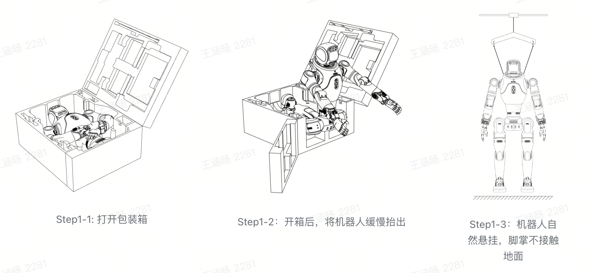
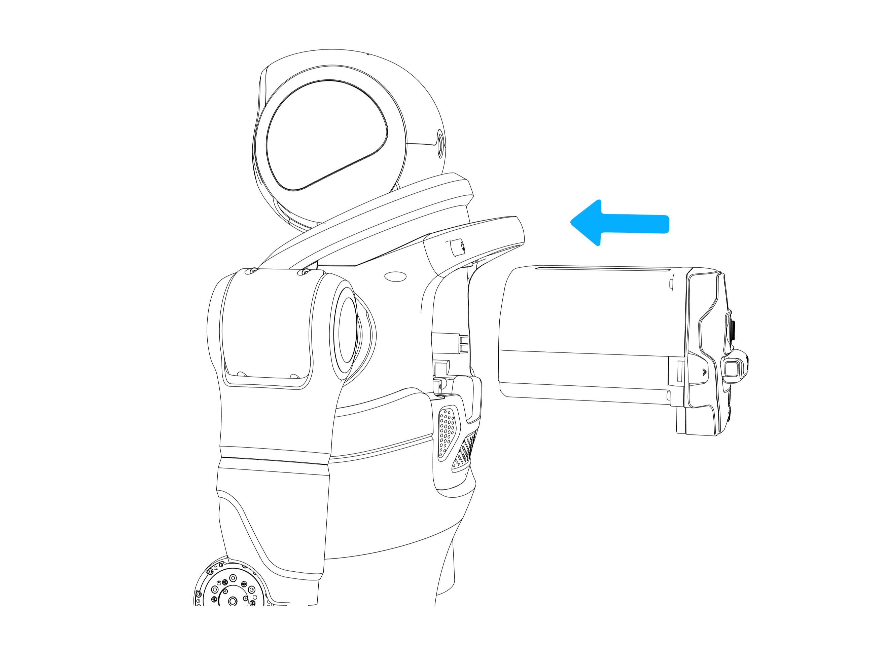
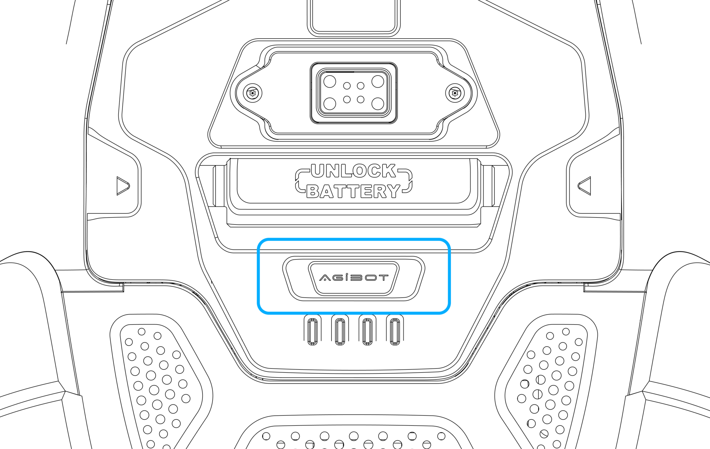
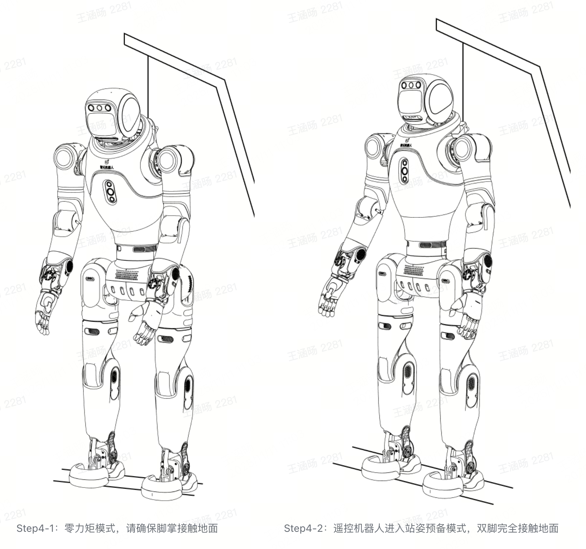
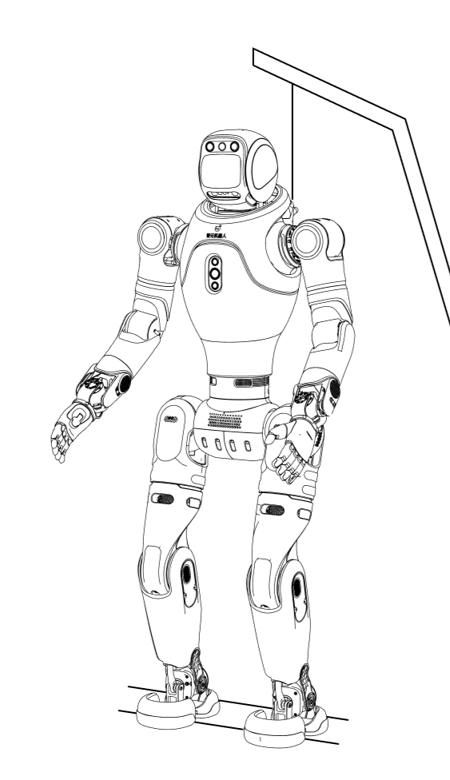
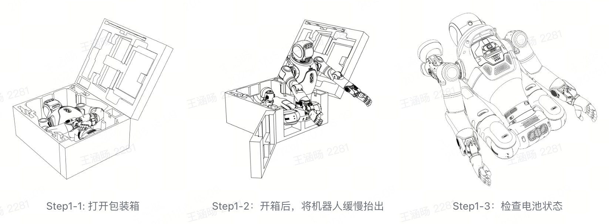
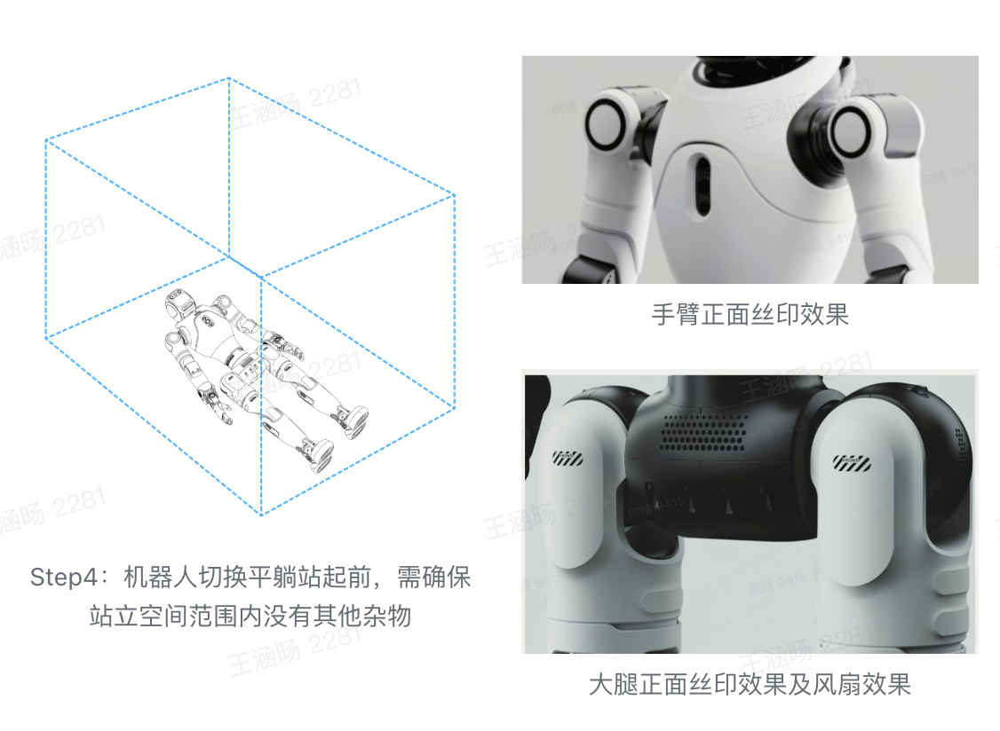
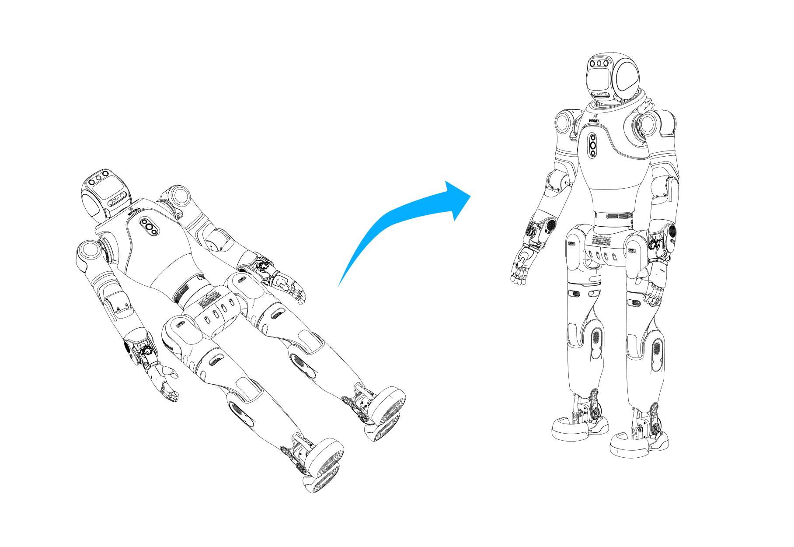
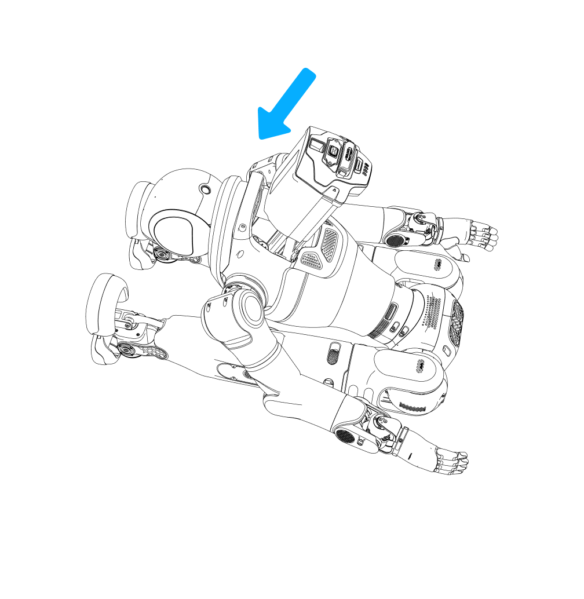
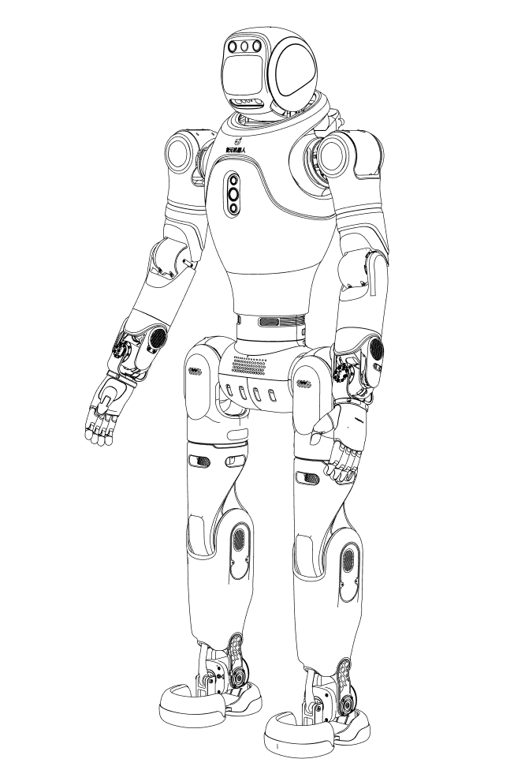

[ AimDK_X2 ](<../index.html>)

  * [1 __关于 AgiBot X2](<../about_agibot_X2/index.html>)
    * [1.1 产品简介](<../about_agibot_X2/part_name.html>)
      * [1.1.1 旗舰版（X2 Ultra）](<../about_agibot_X2/part_name.html#x2-ultra>)
    * [1.2 机器人具体参数](<../about_agibot_X2/robot_specifications.html>)
      * [1.2.1 X2 系列参数](<../about_agibot_X2/robot_specifications.html#x2>)
    * [1.3 计算单元](<../about_agibot_X2/onboard_computer.html>)
      * [1.3.1 标配计算单元](<../about_agibot_X2/onboard_computer.html#id2>)
      * [1.3.2 开发计算单元具体参数](<../about_agibot_X2/onboard_computer.html#id3>)
    * [1.4 用户调试接口（旗舰版）](<../about_agibot_X2/user_debug_interface.html>)
    * [1.5 二次开发接口（旗舰版）](<../about_agibot_X2/SDK_interface.html>)
    * [1.6 灵犀X2 传感器说明](<../about_agibot_X2/sensor_fov.html>)
      * [1.6.1 传感器能力及视场角示意图](<../about_agibot_X2/sensor_fov.html#id1>)
      * [1.6.2 传感器具体参数](<../about_agibot_X2/sensor_fov.html#id2>)
        * [激光雷达](<../about_agibot_X2/sensor_fov.html#id3>)
        * [RGBD摄像头](<../about_agibot_X2/sensor_fov.html#rgbd>)
        * [前视双目RGB摄像头](<../about_agibot_X2/sensor_fov.html#rgb>)
        * [前视交互RGB摄像头](<../about_agibot_X2/sensor_fov.html#id4>)
        * [后视RGB摄像头](<../about_agibot_X2/sensor_fov.html#id5>)
        * [触摸传感器](<../about_agibot_X2/sensor_fov.html#id6>)
        * [独立惯性传感器（IMU）](<../about_agibot_X2/sensor_fov.html#imu>)
    * [1.7 关节活动范围说明](<../about_agibot_X2/joint_name_and_limit.html>)
      * [1.7.1 手臂可保证活动空间](<../about_agibot_X2/joint_name_and_limit.html#id2>)
      * [1.7.2 腿部可保证活动空间](<../about_agibot_X2/joint_name_and_limit.html#id3>)
      * [1.7.3 头部可保证活动空间](<../about_agibot_X2/joint_name_and_limit.html#id4>)
      * [1.7.4 腰部活动空间](<../about_agibot_X2/joint_name_and_limit.html#id5>)
    * [1.8 坐标系](<../about_agibot_X2/coordinate_system.html>)
  * [2 __操作指南](<index.html>)
    * 2.1 开机指南
      * 2.1.1 吊起开机（需移位机）(SDK推荐使用)
      * 2.1.2 平躺站起开机（无需移位机）
      * 2.1.3 坐下站起开机（无需移位机）
    * [2.2 机器人手机APP连接（Agibot Go APP）](<robot_connection.html>)
      * [2.2.1 下载地址](<robot_connection.html#id1>)
        * [iOS](<robot_connection.html#ios>)
        * [Android](<robot_connection.html#android>)
        * [操作步骤](<robot_connection.html#id2>)
    * [2.3 遥控手柄连接](<remote_controller.html>)
      * [2.3.1 操作步骤](<remote_controller.html#id2>)
    * [2.4 关机指南](<shutdown.html>)
      * [2.4.1 辅助躺下机器人（无需移位机）](<shutdown.html#id2>)
        * [Step 1: 进入站姿预备模式（位控站立）](<shutdown.html#step-1>)
        * [Step 2: 平躺机器人](<shutdown.html#step-2>)
        * [Step 3: 进入零力矩模式](<shutdown.html#step-3>)
        * [Step 5：将机器人按图示指引装箱](<shutdown.html#step-5>)
      * [2.4.2 坐下关机（无需移位机）](<shutdown.html#id3>)
        * [Step 1：遥控机器人坐下](<shutdown.html#id4>)
        * [Step 2：进入零力矩模式](<shutdown.html#id5>)
        * [Step 3：关机](<shutdown.html#id6>)
        * [Step 4: 将机器人按图示指引装箱](<shutdown.html#id7>)
  * [3 __获取SDK](<../get_sdk/index.html>)
  * [4 __快速开始](<../quick_start/index.html>)
    * [4.1 阅读用户使用指南，熟悉相关术语及安全注意事项](<../quick_start/prerequisites.html>)
    * [4.2 完成基础系统配置](<../quick_start/prerequisites.html#id2>)
    * [4.3 网络连接](<../quick_start/prerequisites.html#id3>)
    * [4.4 环境安装和配置](<../quick_start/prerequisites.html#aimdk-build>)
    * [4.5 运行一个代码示例](<../quick_start/run_example.html>)
      * [4.5.1 获取机器人的当前状态](<../quick_start/run_example.html#id1>)
      * [4.5.2 让机器人挥手](<../quick_start/run_example.html#id2>)
    * [4.6 代码编写](<../quick_start/code_sample.html>)
      * [4.6.1 项目概述](<../quick_start/code_sample.html#id2>)
      * [4.6.2 在现有SDK工作空间中添加示例](<../quick_start/code_sample.html#sdk>)
        * [了解现有结构](<../quick_start/code_sample.html#id3>)
        * [添加新的Python示例](<../quick_start/code_sample.html#python>)
      * [4.6.3 编写控制代码](<../quick_start/code_sample.html#id4>)
        * [创建机器人控制类](<../quick_start/code_sample.html#id5>)
        * [添加主程序入口](<../quick_start/code_sample.html#id6>)
        * [注册到构建系统](<../quick_start/code_sample.html#id7>)
      * [4.6.4 构建与运行](<../quick_start/code_sample.html#id8>)
        * [构建项目](<../quick_start/code_sample.html#id9>)
        * [运行项目](<../quick_start/code_sample.html#id10>)
      * [4.6.5 代码解析](<../quick_start/code_sample.html#id11>)
        * [机器人控制类](<../quick_start/code_sample.html#id12>)
      * [4.6.6 扩展与优化](<../quick_start/code_sample.html#id13>)
        * [添加更多动作和交互](<../quick_start/code_sample.html#id14>)
        * [添加参数配置](<../quick_start/code_sample.html#id15>)
        * [添加错误处理](<../quick_start/code_sample.html#id16>)
        * [添加更多交互功能](<../quick_start/code_sample.html#id17>)
      * [4.6.7 遇到问题时排查解决](<../quick_start/code_sample.html#id18>)
      * [4.6.8 下一步学习](<../quick_start/code_sample.html#id19>)
      * [4.6.9 小结](<../quick_start/code_sample.html#id20>)
  * [5 __接口说明](<../Interface/index.html>)
    * [5.1 控制模块](<../Interface/control_mod/index.html>)
      * [5.1.1 运动模式切换](<../Interface/control_mod/modeswitch.html>)
        * [核心功能](<../Interface/control_mod/modeswitch.html#id2>)
        * [查询运动模式服务](<../Interface/control_mod/modeswitch.html#id3>)
        * [设置运动模式服务](<../Interface/control_mod/modeswitch.html#id4>)
        * [编程示例](<../Interface/control_mod/modeswitch.html#id5>)
        * [安全注意事项](<../Interface/control_mod/modeswitch.html#id6>)
      * [5.1.2 走跑控制](<../Interface/control_mod/locomotion.html>)
        * [控制功能](<../Interface/control_mod/locomotion.html#id2>)
        * [走跑控制话题](<../Interface/control_mod/locomotion.html#id3>)
        * [编程示例](<../Interface/control_mod/locomotion.html#id4>)
        * [安全注意事项](<../Interface/control_mod/locomotion.html#id5>)
      * [5.1.3 MC控制信号设置](<../Interface/control_mod/MC_control.html>)
        * [核心特性](<../Interface/control_mod/MC_control.html#id1>)
        * [输入源配置](<../Interface/control_mod/MC_control.html#id3>)
        * [仲裁流程](<../Interface/control_mod/MC_control.html#id5>)
        * [输入源管理服务](<../Interface/control_mod/MC_control.html#id7>)
        * [编程示例](<../Interface/control_mod/MC_control.html#id8>)
        * [注意事项](<../Interface/control_mod/MC_control.html#id9>)
      * [5.1.4 预设动作控制](<../Interface/control_mod/preset_motion.html>)
        * [预设动作控制服务](<../Interface/control_mod/preset_motion.html#id2>)
        * [编程示例](<../Interface/control_mod/preset_motion.html#id3>)
        * [安全注意事项](<../Interface/control_mod/preset_motion.html#id4>)
      * [5.1.5 末端执行器控制](<../Interface/control_mod/endeffector.html>)
        * [手部控制特点](<../Interface/control_mod/endeffector.html#id2>)
        * [手部控制话题](<../Interface/control_mod/endeffector.html#id3>)
        * [手部状态信息话题](<../Interface/control_mod/endeffector.html#id4>)
        * [查询手部类型服务](<../Interface/control_mod/endeffector.html#id5>)
        * [编程示例](<../Interface/control_mod/endeffector.html#id6>)
        * [安全注意事项](<../Interface/control_mod/endeffector.html#id7>)
      * [5.1.6 关节控制](<../Interface/control_mod/joint_control.html>)
        * [核心特性](<../Interface/control_mod/joint_control.html#id2>)
        * [关节控制话题](<../Interface/control_mod/joint_control.html#id5>)
        * [关节状态查询服务](<../Interface/control_mod/joint_control.html#id6>)
        * [编程示例](<../Interface/control_mod/joint_control.html#id7>)
        * [安全注意事项](<../Interface/control_mod/joint_control.html#id8>)
    * [5.2 交互模块](<../Interface/interactor/index.html>)
      * [5.2.1 语音控制](<../Interface/interactor/voice.html>)
        * [核心特性](<../Interface/interactor/voice.html#id2>)
        * [音量控制服务](<../Interface/interactor/voice.html#id6>)
        * [语音合成服务](<../Interface/interactor/voice.html#id7>)
        * [音频文件播放服务](<../Interface/interactor/voice.html#id8>)
        * [MIC音频流采集话题](<../Interface/interactor/voice.html#mic-receiver-vad>)
        * [编程示例](<../Interface/interactor/voice.html#id9>)
        * [安全注意事项](<../Interface/interactor/voice.html#id10>)
      * [5.2.2 屏幕控制](<../Interface/interactor/screen.html>)
        * [核心功能](<../Interface/interactor/screen.html#id2>)
        * [表情播放状态查询话题](<../Interface/interactor/screen.html#id3>)
        * [表情播放服务](<../Interface/interactor/screen.html#id4>)
        * [视频播放服务](<../Interface/interactor/screen.html#id5>)
        * [编程示例](<../Interface/interactor/screen.html#id6>)
        * [安全注意事项](<../Interface/interactor/screen.html#id7>)
      * [5.2.3 灯带控制](<../Interface/interactor/lights.html>)
        * [核心特性](<../Interface/interactor/lights.html#id2>)
        * [灯带控制服务](<../Interface/interactor/lights.html#id3>)
        * [编程示例](<../Interface/interactor/lights.html#id4>)
    * [5.3 故障与系统管理模块 (待发布)](<../Interface/FASM/index.html>)
      * [5.3.1 故障处理 （待上线）](<../Interface/FASM/fault.html>)
      * [5.3.2 权限管理 （待上线）](<../Interface/FASM/sudo.html>)
    * [5.4 硬件抽象模块](<../Interface/hal/index.html>)
      * [5.4.1 传感器接口](<../Interface/hal/sensor.html>)
        * [核心功能](<../Interface/hal/sensor.html#id2>)
        * [标准传感器消息](<../Interface/hal/sensor.html#id6>)
        * [IMU话题](<../Interface/hal/sensor.html#imu>)
        * [头部触摸状态话题](<../Interface/hal/sensor.html#id7>)
        * [后视RGB相机话题](<../Interface/hal/sensor.html#rgb>)
        * [双目相机话题](<../Interface/hal/sensor.html#id8>)
        * [深度相机话题](<../Interface/hal/sensor.html#interface-rgbd-camera>)
        * [Lidar话题](<../Interface/hal/sensor.html#interface-lidar>)
        * [编程示例](<../Interface/hal/sensor.html#id9>)
        * [安全注意事项](<../Interface/hal/sensor.html#id10>)
      * [5.4.2 电源管理单元 (PMU)](<../Interface/hal/pmu.html>)
        * [核心功能](<../Interface/hal/pmu.html#id1>)
        * [电源管理话题](<../Interface/hal/pmu.html#id5>)
        * [安全注意事项](<../Interface/hal/pmu.html#id6>)
    * [5.5 感知模块（待开放）](<../Interface/perception/index.html>)
      * [5.5.1 视觉(待发布)](<../Interface/perception/vision.html>)
      * [5.5.2 SLAM (待发布)](<../Interface/perception/SLAM.html>)
  * [6 __示例代码](<../example/index.html>)
    * [6.1 Python接口使用示例](<../example/Python.html>)
      * [6.1.1 获取机器人模式](<../example/Python.html#py-get-mc-action>)
      * [6.1.2 设置机器人模式](<../example/Python.html#py-set-mc-action>)
      * [6.1.3 设置机器人动作](<../example/Python.html#py-preset-motion>)
      * [6.1.4 夹爪控制](<../example/Python.html#py-hand-control>)
      * [6.1.5 灵巧手控制](<../example/Python.html#py-omnihand-control>)
      * [6.1.6 注册二开输入源](<../example/Python.html#py-set-mc-input-source>)
      * [6.1.7 获取当前输入源](<../example/Python.html#py-get-mc-input-source>)
      * [6.1.8 控制机器人走跑](<../example/Python.html#py-locomotion>)
      * [6.1.9 关节电机控制](<../example/Python.html#py-motocontrol>)
        * [机器人关节控制示例](<../example/Python.html#py-joint-control>)
      * [6.1.10 键盘控制机器人](<../example/Python.html#py-keyboard>)
      * [6.1.11 拍照](<../example/Python.html#py-take-photo>)
      * [6.1.12 相机推流示例集](<../example/Python.html#py-echo-cameras>)
        * [深度相机数据订阅](<../example/Python.html#py-echo-camera-rgbd>)
        * [双目相机数据订阅](<../example/Python.html#py-echo-camera-stereo>)
        * [头部后置单目相机数据订阅](<../example/Python.html#py-echo-camera-head-rear>)
      * [6.1.13 头部触摸传感器数据订阅](<../example/Python.html#py-echo-head-touch-sensor>)
      * [6.1.14 激光雷达数据订阅](<../example/Python.html#py-echo-lidar-data>)
      * [6.1.15 播放视频](<../example/Python.html#py-play-video>)
      * [6.1.16 媒体文件播放](<../example/Python.html#py-play-media>)
      * [6.1.17 TTS (文字转语音)](<../example/Python.html#py-play-tts>)
      * [6.1.18 麦克风数据接收](<../example/Python.html#py-mic-receiver>)
      * [6.1.19 表情控制](<../example/Python.html#py-play-emoji>)
      * [6.1.20 LED灯带控制](<../example/Python.html#py-play-lights>)
    * [6.2 C++接口使用示例](<../example/Cpp.html>)
      * [6.2.1 获取机器人模式](<../example/Cpp.html#cpp-get-mc-action>)
      * [6.2.2 设置机器人模式](<../example/Cpp.html#cpp-set-mc-action>)
      * [6.2.3 设置机器人动作](<../example/Cpp.html#cpp-preset-motion>)
      * [6.2.4 夹爪控制](<../example/Cpp.html#cpp-hand-control>)
      * [6.2.5 灵巧手控制](<../example/Cpp.html#cpp-omnihand-control>)
      * [6.2.6 注册二开输入源](<../example/Cpp.html#cpp-set-mc-input-source>)
      * [6.2.7 获取当前输入源](<../example/Cpp.html#cpp-get-mc-input-source>)
      * [6.2.8 机器人走跑控制](<../example/Cpp.html#cpp-locomotion>)
      * [6.2.9 关节电机控制](<../example/Cpp.html#cpp-motocontrol>)
        * [机器人关节控制示例](<../example/Cpp.html#cpp-joint-control>)
      * [6.2.10 键盘控制机器人](<../example/Cpp.html#cpp-keyboard>)
      * [6.2.11 拍照](<../example/Cpp.html#cpp-take-photo>)
      * [6.2.12 相机推流示例集](<../example/Cpp.html#cpp-echo-cameras>)
        * [深度相机数据订阅](<../example/Cpp.html#cpp-echo-camera-rgbd>)
        * [双目相机数据订阅](<../example/Cpp.html#cpp-echo-camera-stereo>)
        * [头部后置单目相机数据订阅](<../example/Cpp.html#cpp-echo-camera-head-rear>)
      * [6.2.13 头部触摸传感器数据订阅](<../example/Cpp.html#cpp-echo-head-touch-sensor>)
      * [6.2.14 激光雷达数据订阅](<../example/Cpp.html#cpp-echo-lidar-data>)
      * [6.2.15 播放视频](<../example/Cpp.html#cpp-play-video>)
      * [6.2.16 媒体文件播放](<../example/Cpp.html#cpp-play-media>)
      * [6.2.17 TTS (文字转语音)](<../example/Cpp.html#cpp-play-tts>)
      * [6.2.18 麦克风数据接收](<../example/Cpp.html#cpp-mic-receiver>)
      * [6.2.19 表情控制](<../example/Cpp.html#cpp-play-emoji>)
      * [6.2.20 LED灯带控制](<../example/Cpp.html#cpp-play-lights>)
  * [7 __FAQ](<../faq/index.html>)
  * [8 __特殊过渡方案声明](<../faq/temp_works.html>)
    * [8.1 关闭 X2 自带的交互能力，开发您自己的语音系统](<../faq/temp_works.html#agent-only-voice>)
      * [8.1.1 临时关闭内置交互系统操作步骤](<../faq/temp_works.html#id2>)
      * [8.1.2 恢复内置交互系统操作步骤](<../faq/temp_works.html#id3>)
    * [8.2 机器人运动状态精简，v0.7.x及之前的部分McAction状态码不再支持](<../faq/temp_works.html#v0-7-xmcaction>)
  * [9 __二次开发边界与声明](<../end_notes.html>)

  * [__版本更新记录](<../changelog.html>)
    * [Changelog v0.9.0](<../changelog.html#changelog-v0-9-0>)
      * [新开放功能](<../changelog.html#id2>)
      * [现有功能调整](<../changelog.html#id3>)
      * [迭代优化掉的功能](<../changelog.html#id4>)
    * [Changelog v0.8.2](<../changelog.html#changelog-v0-8-2>)
      * [新开放功能](<../changelog.html#id5>)
      * [现有功能调整](<../changelog.html#id6>)
      * [迭代优化掉的功能](<../changelog.html#id7>)
    * [Changelog v0.8.1](<../changelog.html#changelog-v0-8-1>)
      * [新开放功能](<../changelog.html#id8>)
      * [现有功能调整](<../changelog.html#id9>)
      * [迭代优化掉的功能](<../changelog.html#id10>)
    * [Changelog v0.8.0](<../changelog.html#changelog-v0-8-0>)
      * [新开放功能](<../changelog.html#id11>)
      * [现有功能调整](<../changelog.html#id12>)
      * [迭代优化掉的功能](<../changelog.html#id13>)
      * [其他更新](<../changelog.html#id14>)
  * [__AimDK使用问题反馈](<../feedback.html>)

__[AimDK_X2](<../index.html>)

  * 
  * [2 __操作指南](<index.html>)
  * 2.1 开机指南
  * 

* * *

# 2.1 开机指南

## 2.1.1 吊起开机（需移位机）(SDK推荐使用)

**Step 1：开箱抬出并规范摆放** 按图示开箱，将机器人缓慢抬出。 使用保护架将机器人自然悬挂，确保其脚掌末端不接触地面。

* * *

**Step 2：安装电池** 若未安装电池，可将电池从外向内插入机器人背部的电池槽，插至底部听到 “咔哒” 声即安装成功，安装成功后，请再次按压电池保证电池已经完全插入电池槽。

Step2：检查电池安装及安装电池

* * *

**Step 3: 开机启动**

  * 开机时，请先确认电池电量＞2 格（电池电量＞50%）。

  * 短按电池背部电源键唤醒设备，随后长按 5 秒完成开机。

  * 机器人通电后，电池的 LED1~4 指示灯会在 2 秒内依次跑马亮起，随后稳定亮灭状态指示电池电量。

Step 3:按下开机按键

* * *

**Step 4: 切换站姿预备（位控站立）模式**

  * **初始化** ：开机后需等待约 1 分钟，期间请勿操作。开机后所有关节进入零力矩状态，即表示初始化成功。

  * **调整悬挂** ：初始化完成后，下降悬挂绳，使 X2 双足完全触地，进入站姿预备（位控站立）模式。

  * **进入站姿预备模式** ：通过遥控器同时短按【L2+X】按键，确认触发站姿预备（位控站立）模式。

* * *

**Step 5: 完成机身下降**

  * 用电动移位器将机器人缓慢降下，直至双脚完全触地、悬挂绳完全放松且留有余量。

  * 过程中需确保机器人垂直站立，不可出现倾斜。

**Step 6: 进入稳定站立（力控站立）模式**

重要

注意：在切换稳定站立（力控站立）模式之前，请确保机器人已经下降至地面，双脚与地面完全接触。

  * **进入稳定站立（力控站立）模式** ：通过遥控器同时短按【R2+X】按键，触发稳定站立（力控站立）模式，具体姿态可参考对应图示。

  * **释放挂钩** ：待 X2 站立稳定后，可完全释放悬挂挂钩。

  * 稳定站立（力控站立）模式下，机器人轻微推动时可保持平衡，且支持身体运动控制。

Step6：遥控切换进入稳定站立（力控站立）模式

**Step 7：进入走跑模式**

进入稳定站立模式后，可实现 **“推杆即走”** ：

  * 左摇杆推上下左右，控制机器人行走方向；

  * 右摇杆推动，控制机器人原地旋转。

* * *

## 2.1.2 平躺站起开机（无需移位机）

**Step 1：开箱抬出并规范摆放** 按照图示打开机器人的包装箱，缓慢将机器人抬出，避免碰撞。  
将机器人按照下述图示姿态摆放，便于检查机器人背部的电池电量状态或放置电池。

* * *

**Step 2：安装电池** 若未安装电池，可将电池从外向内滑入背部电池槽，滑至底部听到 “咔哒” 声即安装成功。安装后可尝试拉拔电池，确认其已完全卡紧。

Step2：检查电池安装及安装电池

* * *

**Step 3: 开机启动**

  * 开机时，请先确认电池电量＞2 格（电池电量＞50%）。

  * 短按电池背部电源键唤醒设备，随后长按 5 秒完成开机。

  * 机器人通电后，电池的 LED1~4 指示灯会在 2 秒内依次跑马亮起，随后稳定亮灭状态指示电池电量。

Step 3:按下开机按键

**Step 4: 机器人仰身平躺**

  * 将机器人置为仰身躺姿，需伸展其腿部与手部，确保机器人正面朝上。此时机器人处于零力矩模式。 *请参考下方图示，将头部、腿部、手臂、胸部、腰部、胯部摆至正确初始姿态，尤其注意下肢胯部正面需与整机正面保持一致。

  * 触发平躺站起动作前，需确保机器人四周半径 0.5 米范围内无任何杂物，为动作执行预留充足安全空间。

**Step 5: 平躺站起开机**

  * 遥控器同时短按遥控【 ↑+△】，可实现机器人平躺站起，此时机器人进入稳定站立状态。

Step 5:机器人从平躺状态自动站起

**Step 6：进入走跑模式**

进入稳定站立模式后，可实现 **“推杆即走”** ：

  * 左摇杆推上下左右，控制机器人行走方向；

  * 右摇杆推动，控制机器人原地旋转。

* * *

重要

  1. **平躺站起禁止执行场景：**  
当前暂不支持末端执行器为灵巧手或夹爪时，执行平躺站起动作，避免损坏灵巧手或夹爪部件。

  2. **平躺站起前姿态要求：**  
执行平躺站起前，需将机器人调整为正面朝上的姿态。  
同时确保头部、腿部、手臂、胸部、腰部、膝部等关键部位摆放正确，防止因姿态不当造成设备损坏。

  3. **平躺站起地面环境要求：**  
需将机器人平整放置在 **无坡度的硬质地面上** ，再启动平躺站起动作，确保动作过程稳定。

## 2.1.3 坐下站起开机（无需移位机）

**Step 1：开箱抬出并规范摆放** 按照图示打开机器人的包装箱，缓慢将机器人抬出，避免搬运中碰撞。  
将机器人按照下述图示姿态摆放，便于检查机器人背部的电池电量状态或放置电池。

* * *

**Step 2：安装电池** 若未安装电池，可将电池从外向内滑入背部电池槽，滑至底部听到 “咔哒” 声即安装成功。安装后可尝试拉拔电池，确认其已完全卡紧。

Step2：检查电池安装及安装电池

* * *

**Step 3: 开机启动**

  * 开机时，请先确认电池电量＞2 格（电池电量＞50%）。

  * 短按电池背部电源键唤醒设备，随后长按 5 秒完成开机。

  * 机器人通电后，电池的 LED1~4 指示灯会在 2 秒内依次跑马亮起，随后稳定亮灭状态指示电池电量。

Step 3:按下开机按键

**Step 4: 机器人摆放至坐下姿态**

  1. **姿态调整：**  
将机器人摆放为图示姿态。

  2. **关键要求：**

     * 需将 **头部、腿部、手臂、胸部、腰部、膝部** 摆至正确初始姿态，尤其注意下肢膝部正面需与整机正面一致朝前。

     * 需将机器人放置在 **高度 35–40 cm 范围内的椅子上** ，请注意椅子需要有靠背支撑以保持机器人平衡。

     * 此时机器人处于零力矩模式。需人工扶着机器人后把手，辅助保持平衡。

  3. **模式触发：**  
同时按下遥控器 **【↑ + X】** 按键，机器人进入坐姿预备（位控坐下）模式。

     * 请注意此过程中需要人工扶着机器人后把手，辅助保持平衡。

Step4：机器人摆放至坐姿状态，切换坐姿预备模式

* * *

重要

  1. **机器人坐姿要求：**  
需按照下图例，先通过遥控器将机器人调整至坐下位控状态。同时，需将机器人放置在高度约 35-40cm 的凳子上，确保放置位置稳定。触发坐下站起动作前，必须确认机器人的双脚已完全接触地面，避免因脚部悬空导致动作异常。

  2. **肢体姿态要求：**  
需将机器人的头部、腿部、手臂、胸部、腰部、胯部等关键部位按照图示正确摆放，且保持正面朝前，防止姿态不当情况下切换对机器人造成损坏。

* * *

**Step 5: 站起开机**

  * 操作遥控器，同时短按【↑+□】按键，机器人将执行坐下站起动作，动作完成后直接进入稳定站立模式。

* * *

重要

坐下站起过程中，需人工拉动机器人后把手辅助保持平衡，防止机器人摔倒。

Step5：机器人站起状态

**Step 6：进入走跑模式** 进入稳定站立模式后，可实现 **“推杆即走”** ：

  * 左摇杆推上下左右，控制机器人行走方向；

  * 右摇杆推动，控制机器人原地旋转。

[ 上一页](<index.html> "2 操作指南") [下一页 ](<robot_connection.html> "2.2 机器人手机APP连接（Agibot Go APP）")

* * *

(C) 版权所有 2025 智元创新（上海）科技股份有限公司。

[沪ICP备2023019007号-2](<https://beian.miit.gov.cn>)[沪公网安备31011502401815号](<http://www.beian.gov.cn/portal/registerSystemInfo?recordcode=31011502401815>)
